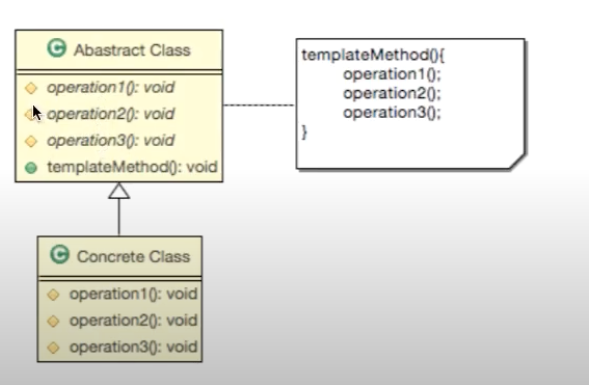
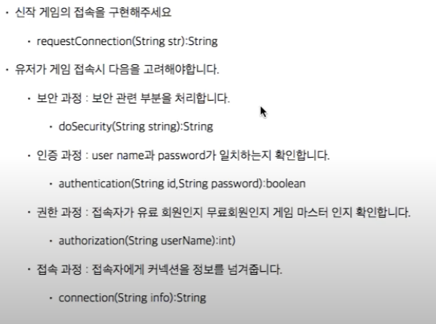

### 템플릿 메소드 패턴이란
- 일정한 프로세스(여러 알고리즘들의 순서가 있는 경우)를 가진 요구사항을 템플릿 메소드 패턴을 이용하여 구현 가능

- 사전적 의미의 템플릿은 무엇인가? => 모양자에 다른 색깔의 연필로 동그라미를 만들어 내는 행위라고 볼 수 있다.
1. 알고리즘의 구조를 메소드에 정의
2. 하위 클래스에서 알고리즘의 `구조의 변경없이` `알고리즘 재정의` 하는 패턴

#### 특징
1. 알고리즘이 `일정한 프로세스`가 있다.
2. 변경 대처에 유연하다.

#### 구현 방법
1. 여러 단계의 알고리즘 정의
2. 나눠진 알고리즘의 단계를 메소드로 선언
3. 알고리즘을 수행할 `템플릿 메소드`를 만든다.
4. 하위 클래스에서 `나눠진 메소드들을 구현`한다.

#### 요구 사항
